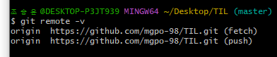

# 2022-07-06 학습

### 깃 허브

깃허브에 대해 배우고 업로드 하는 방법을 배웠다


깃 파일을 킨후 저부분을 복사하여 붙여준다

- 

- ```
  git remote add origin https://github.com/mgpo-98/test0706.git
  ```

​		remote :원격 저장소  add: 추가해 origin 이름? 으로 해석이 가능하고

​		뒤는 깃허브 주소와/사용자 이름/저장소 이름 으로 해석할수있다

​		(여기서 복붙 할떄 Ctrl+ v가 아닌 Shift +ins  or Paste(마우스 우클릭))으로 사용해야한다

 - $ git remote -v 를 입력하여 원격 저장소의 정보를 입력한다

   origin 원격 저장소 이름!

   

 - $ git push origin master 를 해야 버전(커밋이 올라간다)


​			*오늘 저 오류 때문에 열심히 질문하고 구글링끝에 겨우 해결하여 업로드에 성공하였다. 

​				하지만 저 오류 코드때문에 오늘 강의를 완전히 날려 먹었다 (1도 못들음... ㅠㅠ)


