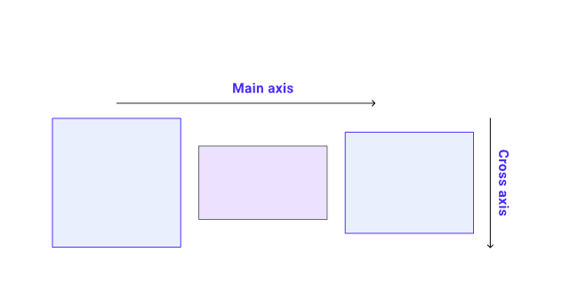

HTNL(HyperText Markup Language)

- 정의 ([HTNL](https://developer.mozilla.org/ko/docs/Web/HTML))

  - 웹을 이루는 가장 기초적인 구성 요소(웹 콘텐츠의 의미와 구조를 정의할때 사용)
  - [CSS](https://developer.mozilla.org/ko/docs/Web/CSS): 웹페이지의 모양/표현
  - [JavaScript](https://developer.mozilla.org/ko/docs/Web/JavaScript):기능/동작

- 하이퍼텍스트 (Hypertext): 웹 페이지를 다른 페이지로 연결하는 링크 

  - HTML은 웹 브라우저에 표시되는 글과 이미지 등의 다양한 콘텐츠를 표시하기 위해 마크업

    - 마크업 요소는 :[head](https://developer.mozilla.org/ko/docs/Web/HTML/Element/head) , [title][https://developer.mozilla.org/ko/docs/Web/HTML/Element/title] [body][https://developer.mozilla.org/ko/docs/Web/HTML/Element/body] , [header][https://developer.mozilla.org/ko/docs/Web/HTML/Element/header] 등이 있다

      <.h1> 제목 <./h1> 이런식으로 표현이 된다

    - html: 문서의 최상위 요소

    - head 문서 메타데이터 요소 (문서 제목, 인코딩, 스타일 등)

    - body:문서 본문 요소 (실제 화면 구성과 관련된 내용)  

    - title : 브라우저 상단 타이틀

    - meata : 문서 레벨 메타데이터 요소

    - link :외부 링크 연결 요소

    - script :스크립트 요소

    - style : css 직접 작성

    - 

  - 요소:
    1. 요소 이름 (또는 요소가 하나 이상 속성을 이미 가지고 있다면 이전 속성)과 속성 사이에 공백이 있어야 합니다.
    2. 속성 이름 뒤에는 등호(=)가 와야 합니다.
    3. 속성 값의 앞 뒤에 열고 닫는 인용부호(" 또는 ')가 있어야 합니다.

### 문단 ('.'  생략)

<.p>:  로 문단을 표현한다

​    

```
<p>내 고양이는 <strong>아주</strong> 고약해.</p>
```

```
<p>내 고양이는 <strong>아주 고약해.</p></strong>
```

 - alt를 사용하여  빈요소

   - ```
     
     
     ```

### 목록

<.li> 로 목록항목 을 표현한다 

- **순서 없는 목록은** 쇼핑 목록과 같이 항목의 순서에 관계가 없는 목록을 위한 것입니다. [``](https://developer.mozilla.org/ko/docs/Web/HTML/Element/ul) 요소로 둘러 쌓여 있습니다.
- **순서 있는 리스트**는 조리법처럼 항목의 순서가 중요한 목록을 위한 것입니다. [``](https://developer.mozilla.org/ko/docs/Web/HTML/Element/ol) 요소로 둘러 쌓여 있습니다.

```
<p>At Mozilla, we’re a global community of</p>

<ul>
  <li>technologists</li>
  <li>thinkers</li>
  <li>builders</li>
</ul>

<p>working together ... </p>
```

#### 연결

- "anchor" 의 약자입니다 연결을 하기 위해, 간단한 요소를 사용할 필요가 있습니다

- 아래와 같이 사용한다

- ```
  <a href="https://www.mozilla.org/en-US/about/manifesto/">Mozilla Manifesto</a>
  ```

# css Cascading Style Sheets

- HTML이나 xml 로 작성된 문서의 표시 방법을 기술하기 위한 트아일 시트 언어

- 화면, 종이, 음성이나 다른 매체 상에 어떻게 렌링되어야 하는지 지정합니다.

- `width` (한 요소의 너비)

- `background-color`, 요소의 콘텐츠와 padding 의 배경 색

- `color`, 한 요소의 콘텐츠 색 (일반적으로 글자색)

- `text-shadow`: 한 요소 안의 글자에 그림자를 적용

- `display`: 요소의 표시 형식을 설정합니다 (이것에 대해선 아직 걱정하지마세요)

  ## CSS 란?

```
p {
  color: red;
}
```

위와 같이 문자의 텍스트의 색갈을 변경할때 사용한다

이때 

```
p {
  color: red;
  width: 500px;
  border: 1px solid black;
}
```

폰트의 크기와 위치도 원하는 만큼 변경이 가능하다

```
<link href='http://fonts.googleapis.com/css?family=Open+Sans' rel='stylesheet' type='text/css'>
```

위와같이 원하는 폰트를 찾아 링크를 가져온후 폰트 변경도 가능하다

### 페이지 색 바꾸기

```
html {
  background-color: #00539F;
}
```

#### body 외부 정렬하기

```
body {
  width: 600px;
  margin: 0 auto;
  background-color: #FF9500;
  padding: 0 20px 20px 20px;
  border: 5px solid black;
}
```

- `width: 600px;` — 이것은 body가 항상 600 pixels 의 너비를 갖도록 강제합니다.

- `margin: 0 auto;` — 여러분이 `margin` 또는 `padding` 처럼 한 속성에 두개의 값을 설정할 때, 첫 번째 값은 요소의 상단과 하단 (이 예시에서는 0입니다) 에 영향을 주고, 두 번째 값은 좌측 **과** 우측 (여기서, `auto` 는 가능한 수평공간의 왼쪽과 오른쪽을 같게 나눠주는 특별한 값입니다) 에 영향을 줍니다. 여러분은 또한 하나, 셋, 또는 네개의 값을 사용할 수도 있습니다. [여기](https://developer.mozilla.org/ko/docs/Web/CSS/margin#values)에 문서화 되어 있습니다.

- `background-color: #FF9500;` — 전과 같이, 이것은 요소의 배경색을 설정합니다. `html` 요소를 위한 짙은 파란색에 반대되도록 body 에는 붉은 빛을 띄는 오렌지색 같은 것을 사용했었습니다. 한번 시험해보세요. 흰색이나 여러분이 원하는 어떤 색이든 편하게 사용해보세요.

- `padding: 0 20px 20px 20px;` — padding 에는 콘텐츠의 주위에 약간의 공간을 주기 위한 네 개의 값이 있습니다. 이번엔 body의 상단에 no padding, 그리고 왼쪽, 아래 그리고 오른쪽에 20 pixels 을 설정하고 있습니다. 상단, 우측, 하단, 좌측 순서로 값을 설정합니다.(12시부터 시계방향)

- `border: 5px solid black;` — 이것은 간단하게 body 모든 면의 border 를 5 pixels 두깨의 실선으로 설정합니다.

  #### 이미지 가운데 정렬

  ```
  img {
    display: block;
    margin: 0 auto;
  }
  ```

# Flexbox

- 1차원으로 항목 그룹을 배치하도록 설계된 레이아웃 메커니즘

- 행 또는 열로 표시할 수 있습니다.
- 문서의 쓰기 모드를 존중합니다.
- 기본적으로 한 줄이지만 여러 줄로 줄 바꿈하도록 요청할 수 있습니다.
- 레이아웃의 항목이 DOM의 순서와 다르게 시각적으로 재정렬될 수 있습니다.
- 공간이 항목 내부에 분산될 수 있으므로 상위 항목의 사용 가능한 공간에 따라 더 커지고 작아집니다.
- 상자 정렬 속성을 사용하여 래핑된 레이아웃의 항목 및 플렉스 라인 주위에 공간을 분배할 수 있습니다.
- 항목 자체를 교차 축에 정렬할 수 있습니다.



